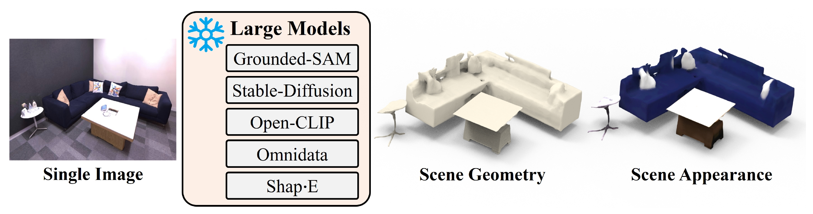
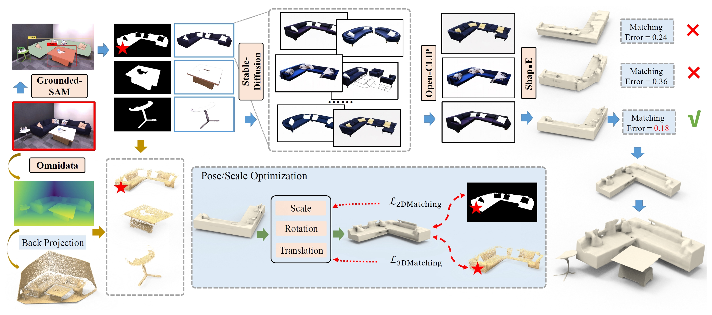
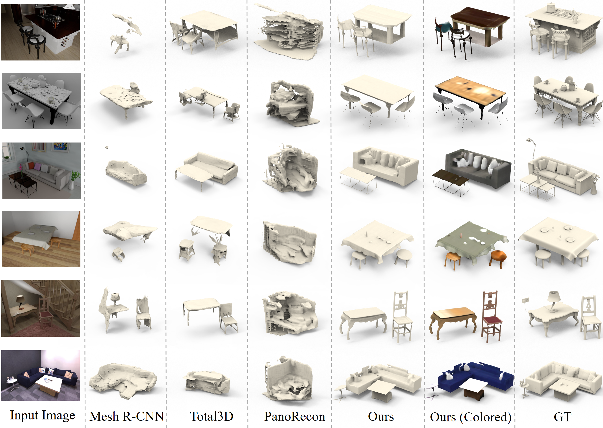
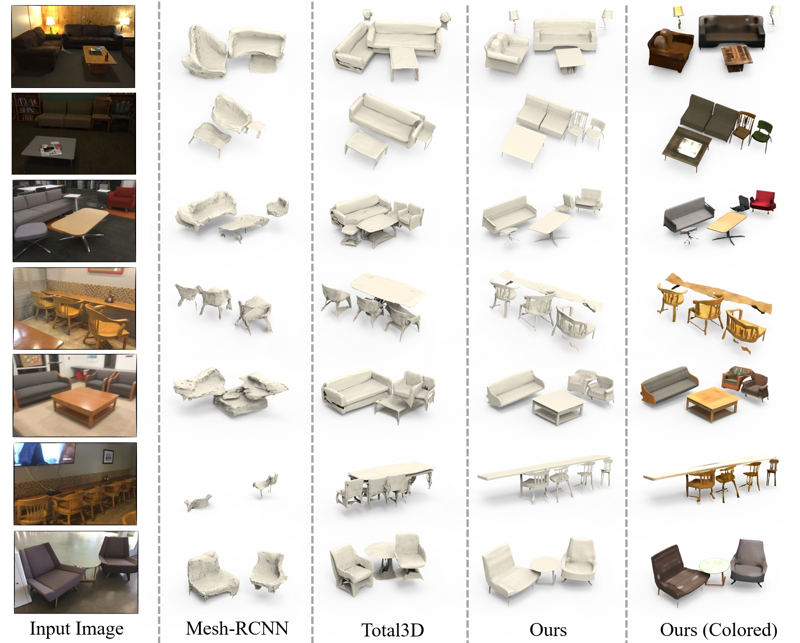

<p align="center">


  <h1 align="center">Zero-Shot Scene Reconstruction from Single Images with Deep Prior Assembly</h1>
  <p align="center" style="font-size: 16px;">
    <a href="https://junshengzhou.github.io/"><strong>Junsheng Zhou</strong></a>
    ·
    <a href="https://yushen-liu.github.io/"><strong>Yu-Shen Liu</strong></a>
    ·
    <a href="https://h312h.github.io/"><strong>Zhizhong Han</strong></a>

  </p>
  <h3 align="center" style="border-bottom: none;">NeurIPS 2024</h3>
  <h3 align="center"><a href="">Paper</a> | <a href="https://junshengzhou.github.io/DeepPriorAssembly/">Project Page</a></h3>
  <div align="center"></div>
</p>

<p align="center">
  
</p>

We present <i>deep prior assembly</i>, a novel framework that assembles diverse deep priors from large models for scene reconstruction from single images in a zero-shot manner. We will release the code of the paper in this repository.

## Overview
<p align="center">
  
</p>
<b>Overview of DeepPriorAssembly.</b> Given a single image of a 3D scene, we detect the instances and segment them with <b><i>Grounded-SAM</i></b>. After normalizing the size and center for the instances, we attempt to amend the quality of the instance images by enhancing and inpainting them. Here, we take a sofa in the image for example. Leveraging the <b><i>Stable-Diffusion</i></b> model, we generate a set of candidate images with the image-to-image generation and a text prompt of the instance category predicted by Grounded-SAM. We then filter out the bad generation samples with <b><i>Open-CLIP</i></b> by evaluating the cosine similarity between the generated instances and original one. After that, we generate multiple 3D model proposals for this instance with <b><i>Shap·E</i></b> from the Top-<i>K</i> generated instance images. Additionally, we estimate the depth of the origin input image with <b><i>Omnidata</i></b> as a 3D geometry prior. To estimate the layout, we propose an approach to optimize the location, orientation and size for each 3D proposal by matching it with the estimated segmentation masks and the depths (the red <b><span style="color: red;">★</span></b> for the example sofa). Finally, we choose the 3D model proposal with minimal matching error as the final prediction of this instance, and the final scene is generated by combining the generated 3D models for all detected instances.

## Visual Comparisons

<p align="center">
  
</p>

## More Comparisons under 3D-Front

<p align="center">
  

</p>

## More Comparisons under BlendSwap and Replica

<p align="center">
  

</p>

## More Comparisons under ScanNet

<p align="center">
  

</p>


## Installation
Clone this repository and install the required packages:

```
git clone https://github.com/junshengzhou/DeepPriorAssembly
cd DeepPriorAssembly

conda create -n dpa python=3.11
conda activate dpa
conda install pytorch torchvision pytorch-cuda=12.1 -c pytorch -c nvidia
```

### Run DeepPriorAssembly:

You should then install the required packages of the large vision models we used: [Grounded-SAM](https://github.com/IDEA-Research/Grounded-Segment-Anything), [Stable-Diffusion](https://github.com/Stability-AI/stablediffusion), [DUST3R](https://github.com/naver/dust3r) and [Shap-E](https://github.com/openai/shap-e). After that, you can start using DeepPriorAssembly by running: 

```
bash run.sh
```

### Easier to run the demo:

If you would just like to have a try on DeepPriorAssembly but do not want to install the complex environment, you can download the prepared demo data in [this link](https://drive.google.com/file/d/1ed6Nan6b7YNdVIv9_OecspAF9QUhu0G6/view?usp=sharing), put it in `data/outputs` and simply run the following command for a scene registration:
```
python registration/optimization_5dof.py --image_id 479d2d66-4d1a-47ca-a023-4286fc547301---rgb_0017 --geometry_dir data/outputs/geometry --mask_dir data/outputs/segmentation --object_dir  data/outputs/object_generation --output_dir data/outputs/final_registration
```

The results will be saved in `data/outputs/final_registration`.

### Notice that:

- We use the DUST3R model to estimate the geometry in the released code. The adjustment is to make the code easier to use by reducing the requirement of camera intrinsics and the ground truth depths. If you would like to use the original Omnidata for geometry estimation, you can 1) follow the [repo](https://github.com/EPFL-VILAB/omnidata) for depth estimation, 2) use ground truth depths for solving depth scale and shift, and 3) project the depth to 3D space using camera intrinsics. 

- By default, we use a 5dof registration model since the image of Front-3D is captured parallelly to the ground. You can run `python optimization_7dof.py` in the `run.sh` for a 7dof registration.

- If you would like to use our code, please remember to check the LICENCES of the assembled large vision models in their codebases. 

## Citation
If you find our code or paper useful, please consider citing

```bib
  @inproceedings{zhou2024deep,
      title = {Zero-Shot Scene Reconstruction from Single Images with Deep Prior Assembly},
      author = {Zhou, Junsheng and Liu, Yu-Shen and Han, Zhizhong},
      booktitle = {Advances in Neural Information Processing Systems (NeurIPS)},
      year = {2024}
  }
```